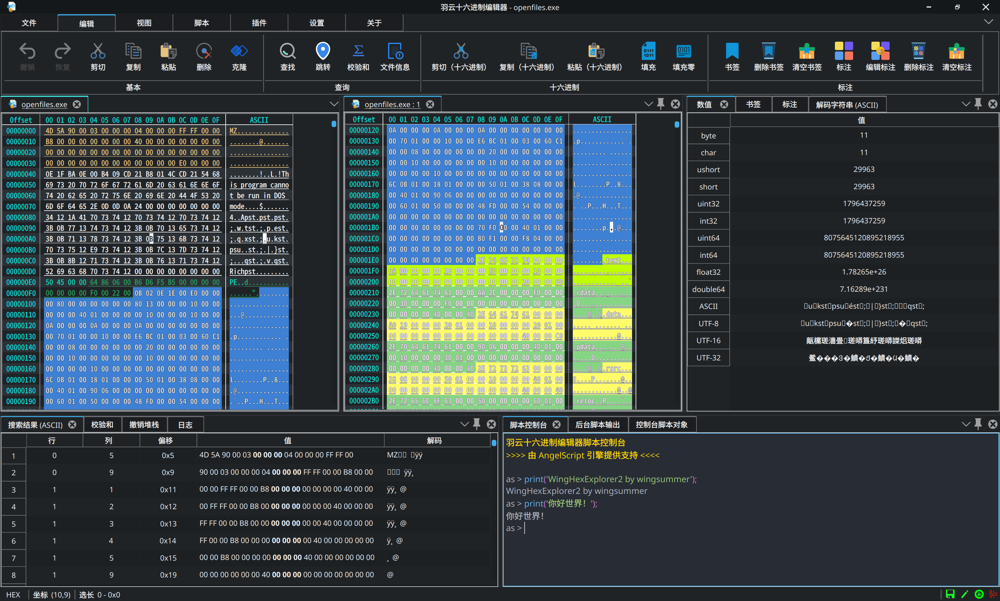

> 如果是你中文用户，请[到此](README.md)

- [Contributors](#contributors)
- [Credit](#credit)
- [Contributing](#contributing)
- [Status](#status)
- [WingHexExplorer2](#winghexexplorer2)
  - [License](#license)
  - [Usage Statement](#usage-statement)
  - [Issue](#issue)
- [Screenshot](#screenshot)
- [Donate](#donate)
- [Related Repository](#related-repository)
- [WIKI](#wiki)
- [Plugins](#plugins)
- [App Store](#app-store)

---

<h1 align="center"> WingSummer.WingHexExplorer2</h1>

 

WingHexExplorer2

- Not easy to open source, please Star or [Donate](#donate)

## Contributors

Maintaining a useful tool is not something that can be done by one person. What is more important is that everyone maintains it together. The following are the people who have contributed to the code of this repository. Special thanks:

<!-- readme: collaborators,contributors -start -->
<table>
	<tbody>
		<tr>
            <td align="center">
                <a href="https://github.com/Wing-summer">
                    
                     
                    <b>wingsummer</b>
                </a>
            </td>
            <td align="center">
                <a href="https://github.com/oPengLuo">
                    
                     
                    <b>大大的力量</b>
                </a>
            </td>
		</tr>
	<tbody>
</table>
<!-- readme: collaborators,contributors -end -->

## Credit

Thanks to the sponsorship of the following people, I will try my best to continue to make a user-friendly, powerful and cross-platform PC-side hexadecimal editor (in chronological order):

| Sponsor |       Comment        |
| :-----: | :------------------: |
|   *欢   | a fellow from Deepin |

## Contributing

- If you want to participate in the development of this software code, please contact me in the pull request.
- This project supports donations. If you are willing, please go to this repository through WeChat or Alipay. If you don't have any of these, you can use Afadian that supports Paypal. The price of a bottle of water is enough to increase my enthusiasm for maintaining the project. Thank you for your support.
- If you want to submit code to fix or improve the program, please submit it in the pull request.
- Any comrades and sponsors who successfully participate in code bug fixes and improve program functions will be reflected in the ReadMe and attached documentation of this repository. If you are one of them, I can explain it according to your reasonable wishes.

\> **Joining us does not mean code maintenance, you can choose one or more of the following to participate**

- Code maintenance: implement new features or fix bugs, maintain and upgrade the code.
- Document editing: mainly interface documents and tutorials need to be written and edited, which is very important.
- Participate in discussions: mainly discuss the future development and direction of this project.
- Write plug-ins: work together to enhance the functionality of the software.

Please see [CONTRIBUTING.md](CONTRIBUTING.md) for getting started with the contribution.

Make sure that you follow [CODE_OF_CONDUCT.md](CODE_OF_CONDUCT.md) while contributing and engaging in the discussions.

## Status

> For Qt 5, only version 5.15.2 or higher is supported, and for Qt 6, only version 6.6.2 or higher is supported. Other lower versions are not supported due to missing APIs of key libraries and some bugs of their own.

&emsp;&emsp;The repository code compiles with Qt 5.15.2 and 6.6.2 on the latest versions of Windows and Ubuntu: 

## WingHexExplorer2

This software is a hexadecimal editor written in QT and developed in C++, providing a powerful and free hexadecimal editor. Currently, only 010 Editor has powerful hexadecimal editing functions, but it is commercial. Those who follow my development activities should know that I developed `WingSummer.WingCloudHexExplorer` developed in C# on Windows, with the purpose of facilitating professionals to modify and analyze PE files, and can be used as an important auxiliary tool for learning PE structure. In addition, I have developed `WingHexExplorer` adapted only for the Deepin platform, and its functions are basically complete. Except for the problem with the large file search function, the others can be used stably. I decided not to maintain `WingHexExplorer` anymore, and I will port and reset this project.

Why developping this project? What is the difference between `WingHexExplorer2` and the original version? First of all, the interface is modified by myself based on the open source project, and I re-implemented my own interface to ensure the UI consistency across platforms. Although the functions are still a little problem compared to the original system, it is just a flaw in the ointment.

The ultimate goal of this project is to create a powerful, lightweight, and cross-platform (only for PC) hex editor. Of course, I cannot achieve this goal by myself, which is one of the purposes of my open source. I only maintain the operating system platform I use, and only respond to the bugs that I can fix on the platform I use in my free time.

If you find that the functions of this project do not meet your needs. Please check if there is any description in `TODO.txt`. If not, you can raise it through `issue`. I will evaluate whether the requirements raised are common. If it is a particularly private requirement, I will not implement it. If you really want to join, please implement the plug-in yourself, and you are also welcome to open source. Don't be fanciful when making suggestions. Please note that this software only provides the most basic hexadecimal editing and browsing services, such as templates and scripts in 010 Editor, which still need everyone to work together through plugins to achieve! I hope that everyone will not only raise requirements, but also put forward constructive suggestions and solutions to jointly maintain the open source community. Specific details will be introduced later.

### License

This software complies with the `AGPL-3.0` agreement. Please do not use it for purposes other than this agreement. My original intention was to make the Linux ecosystem more complete and to promote the localization of the operating system as soon as possible. Cross-platform software is just a by-product. I don't want the "vampires" to take the profits for themselves and do the dirty work for open source. It's all so natural. This is how open source is corrupted. I don't want to be involved in a lot of energy because of copyright issues.

If you want to use the code of this software for closed-source commercial code and want to lift the restriction of the `GPL` series that it must be open source, please consult me ​​in person to discuss commercial licensing matters.

### Usage Statement

1. The source code of this software shall not be used for closed-source commercial purposes unless you open source it completely (as required by the GPL agreement). If you want to commercially close the code of the software warehouse, you must contact me to purchase a commercial license and sign a contract. Please contact me for the price. Please do not disturb me if you are not serious.
2. This software was written in my spare time. Please forgive me for not being able to fix bugs or provide technical support in time.
3. I am not a computer major, and there are inevitably bugs in the program I write. Welcome to submit PR.
4. Whenever you have questions, please read the Wiki in detail.

### Issue

If you have any suggestions, please be sure to read the following statement before submitting an issue to avoid wasting our precious time:

1. If you find that the software does not provide support for your language, you can add it through pull request. Note that the translated text in the code is just an identifier, it may not be the real text, please refer to my Chinese to confirm the translation.
2. For updates, major version plug-ins are incompatible. If there are any problems with the plug-in, please contact the developer (it is not ruled out that I will develop some plug-ins, so you can contact me directly).

All of the above, if you are a like-minded open source contributor, you are welcome to fork my repository for corresponding maintenance!

If a serious bug occurs, I may not respond in time, and I refuse any gossip from the moral high ground.

Without standing on the shoulders of giants, it will not have powerful and stable functions.**The source code of the open source basic projects used in this software that have not been modified by me all comply with the open source agreement of the original author; The parts that I have modified, unless otherwise specified, all comply with the agreement of this repository.**

## Screenshot

WingHexExplorer2

## Donate

> If you are not Chinese, you can use [Afadian](https://afdian.com/a/wingsummer) to support me.

**
Your every support will be a powerful driving force for the advancement of this project. Thank you very much for your support
**

Thanks for your support

Thanks for your support

## Related Repository

The official repository: <https://github.com/Wing-summer/WingHexExplorer2> 。

Of course, there are other repositories as mirror for Chinese users (which will be updated later):

- Gitee：<https://gitee.com/wing-cloud/WingHexExplorer2>
- Gitlink：<https://www.gitlink.org.cn/wingsummer/WingHexExplorer2>
- GitCode：I don't consider it, because "stealing code".

## WIKI

&emsp;&emsp;If you want to learn how to use WingHexEditor and how to develop plug-ins for the software, please go to this link: `Not available yet`. At the same time, you are also welcome to point out errors in the Wiki and contribute high-quality content.

## Plugins

> Stay tuned

## App Store

> Stay tuned
