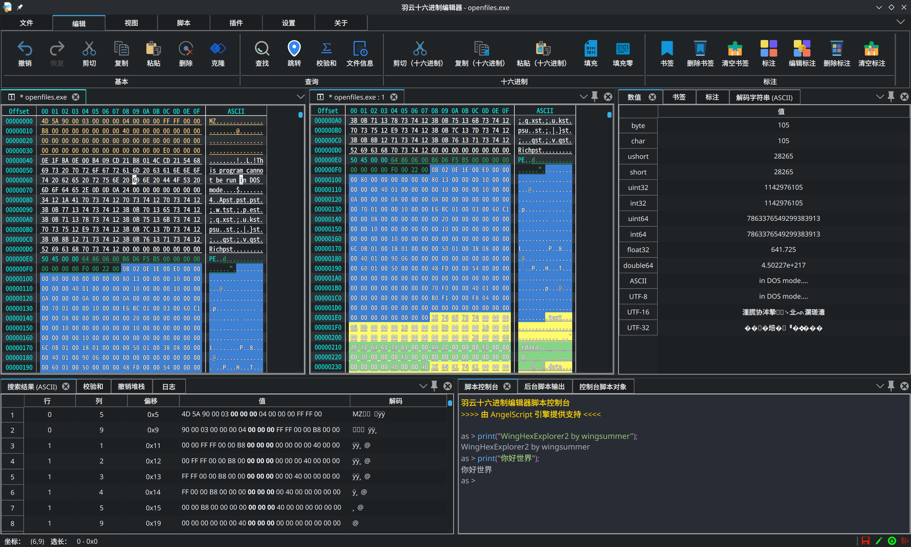

> 如果是你中文用户，请[到此](README.md)

- [Contributors](#contributors)
- [Credit](#credit)
- [Status](#status)
- [WingHexExplorer2](#winghexexplorer2)
  - [Contribution](#contribution)
  - [License](#license)
  - [Usage Statement](#usage-statement)
  - [Issue](#issue)
  - [Open source projects used](#open-source-projects-used)
    - [QHexView](#qhexview)
    - [QHexEdit2](#qhexedit2)
    - [Qt-Advanced-Docking-System](#qt-advanced-docking-system)
    - [QCodeEditor2](#qcodeeditor2)
    - [QWingRibbon](#qwingribbon)
    - [QLogger](#qlogger)
    - [SingleApplication](#singleapplication)
    - [QPathEdit](#qpathedit)
    - [QWindowKit](#qwindowkit)
    - [AngelScript](#angelscript)
    - [QConsoleWidget](#qconsolewidget)
    - [QColorPicker](#qcolorpicker)
    - [QtJsonModel](#qtjsonmodel)
    - [Theme](#theme)
- [Screenshot](#screenshot)
- [Donate](#donate)
- [Related Repository](#related-repository)
- [WIKI](#wiki)
- [Plugins](#plugins)
- [App Store](#app-store)

---

<h1 align="center"> WingSummer.WingHexExplorer2</h1>

WingHexExplorer2

- Not easy to open source, please Star or [Donate](#donate)

## Contributors

Maintaining a useful tool is not something that can be done by one person. What is more important is that everyone maintains it together. The following are the people who have contributed to the code of this repository. Special thanks:

> Wanted

## Credit

Thanks to the sponsorship of the following people, I will try my best to continue to make a user-friendly, powerful and cross-platform PC-side hexadecimal editor (in chronological order):

| Sponsor |       Comment        |
| :-----: | :------------------: |
|   *欢   | a fellow from Deepin |

## Status

> For QT5 version, only version 5.14.0 and above are supported. Other lower versions are not supported because of missing APIs of key libraries.

|     OS     |  QT5  |  QT6  |   faults   |
| :--------: | :---: | :---: | :--------: |
| Windows 11 |   ✔️   |   ✔️   |     -      |
| Deepin 20  |   ✔️   |   ❔   |     -      |
|   MacOS    |   ❌   |   ❌   | Not tested |

## WingHexExplorer2

This software is a hexadecimal editor written in QT and developed in C++, providing a powerful and free hexadecimal editor. Currently, only 010 Editor has powerful hexadecimal editing functions, but it is commercial. Those who follow my development activities should know that I developed `WingSummer.WingCloudHexExplorer` developed in C# on Windows, with the purpose of facilitating professionals to modify and analyze PE files, and can be used as an important auxiliary tool for learning PE structure. In addition, I have developed `WingHexExplorer` adapted only for the Deepin platform, and its functions are basically complete. Except for the problem with the large file search function, the others can be used stably. I decided not to maintain `WingHexExplorer` anymore, and I will port and reset this project.

Why developping this project? What is the difference between `WingHexExplorer2` and the original version? First of all, the interface is modified by myself based on the open source project, and I re-implemented my own interface to ensure the UI consistency across platforms. Although the functions are still a little problem compared to the original system, it is just a flaw in the ointment.

The ultimate goal of this project is to create a powerful, lightweight, and cross-platform (only for PC) hex editor. Of course, I cannot achieve this goal by myself, which is one of the purposes of my open source. I only maintain the operating system platform I use, and only respond to the bugs that I can fix on the platform I use in my free time.

If you find that the functions of this project do not meet your needs. Please check if there is any description in `TODO.txt`. If not, you can raise it through `issue`. I will evaluate whether the requirements raised are common. If it is a particularly private requirement, I will not implement it. If you really want to join, please implement the plug-in yourself, and you are also welcome to open source. Don't be fanciful when making suggestions. Please note that this software only provides the most basic hexadecimal editing and browsing services, such as templates and scripts in 010 Editor, which still need everyone to work together through plugins to achieve! I hope that everyone will not only raise requirements, but also put forward constructive suggestions and solutions to jointly maintain the open source community. Specific details will be introduced later.

### Contribution

- If you want to participate in the development of this software code, please contact me in the pull request.
- This project supports donations. If you are willing, please go to this repository through WeChat or Alipay. If you don't have any of these, you can use Afadian that supports Paypal. The price of a bottle of water is enough to increase my enthusiasm for maintaining the project. Thank you for your support.
- If you want to submit code to fix or improve the program, please submit it in the pull request.
- Any comrades and sponsors who successfully participate in code bug fixes and improve program functions will be reflected in the ReadMe and attached documentation of this repository. If you are one of them, I can explain it according to your reasonable wishes.

\> **Joining us does not mean code maintenance, you can choose one or more of the following to participate**

- Code maintenance: implement new features or fix bugs, maintain and upgrade the code.
- Document editing: mainly interface documents and tutorials need to be written and edited, which is very important.
- Participate in discussions: mainly discuss the future development and direction of this project.
- Write plug-ins: work together to enhance the functionality of the software.

### License

This software complies with the `AGPL-3.0` agreement. Please do not use it for purposes other than this agreement. My original intention was to make the Linux ecosystem more complete and to promote the localization of the operating system as soon as possible. Cross-platform software is just a by-product. I don't want the "vampires" to take the profits for themselves and do the dirty work for open source. It's all so natural. This is how open source is corrupted. I don't want to be involved in a lot of energy because of copyright issues.

If you want to use the code of this software for closed-source commercial code and want to lift the restriction of the `GPL` series that it must be open source, please consult me ​​in person to discuss commercial licensing matters.

### Usage Statement

1. The source code of this software shall not be used for closed-source commercial purposes unless you open source it completely (as required by the GPL agreement). If you want to commercially close the code of the software warehouse, you must contact me to purchase a commercial license and sign a contract. Please contact me for the price. Please do not disturb me if you are not serious.
2. This software was written in my spare time. Please forgive me for not being able to fix bugs or provide technical support in time.
3. I am not a computer major, and there are inevitably bugs in the program I write. Welcome to submit PR.
4. Whenever you have questions, please read the Wiki in detail.

### Issue

If you have any suggestions, please be sure to read the following statement before submitting an issue to avoid wasting our precious time:

1. If you find that the software does not provide support for your language, you can add it through pull request. Note that the translated text in the code is just an identifier, it may not be the real text, please refer to my Chinese to confirm the translation.
2. For updates, major version plug-ins are incompatible. If there are any problems with the plug-in, please contact the developer (it is not ruled out that I will develop some plug-ins, so you can contact me directly).

All of the above, if you are a like-minded open source contributor, you are welcome to fork my repository for corresponding maintenance!

If a serious bug occurs, I may not respond in time, and I refuse any gossip from the moral high ground.

### Open source projects used

Without standing on the shoulders of giants, it will not have powerful and stable functions.**The source code of the open source basic projects used in this software that have not been modified by me all comply with the open source agreement of the original author; The parts that I have modified, unless otherwise specified, all comply with the agreement of this repository.**

#### QHexView

&emsp;&emsp;This software is developed based on `QHexView` as a hexadecimal editor. I added new functions and deeply customized the code based on this component. The following is the necessary instructions for the original warehouse. For details, please click [this link](https://github.com/Dax89/QHexView/tree/master)。

My improvements to this component are as follows:

1. Added functions related to describing the file status: indicating whether it has been modified, whether it has writable permissions, whether the file is locked to prevent modification, and whether the number of bytes can be increased or changed
2. Added the function of hiding the address bar, ASCII decoding character bar, and header
3. Implemented the read and write function module for large files (exceeding 2GB) (the original component did not implement this function)
4. Modified the address display length to adapt to the usage habits of the address
5. Simplified the encoding method and deleted some redundant codes
6. Added more signals to fully control the QHexView component
7. Added bookmark usage and management functions
8. Fixed the bug that the scroll bar related content can still be displayed but still scrolls the content
9. Fixed the problem that the flashing position of the paste pointer remains unchanged, and modified the paste restriction strategy
10. Added some interfaces to adapt to the needs of workspace support
11. Fixed the bug that the first line of the mark background color has an excess part
12. Fixed the bug that the bytes in the copy contain zero bytes and will be truncated
13. Undo and restore support cursor following
14. Upgraded to be compatible with QT6

#### QHexEdit2

At first, I planned to use `QHexEdit2` as the basis for the development of the hexadecimal editor. Although this component can easily open very large files. Its editing function can be used, but there are many bugs. I also fixed them one by one, but found that my strength and time alone were not enough. Then I found `QHexView`, which is the component mentioned above, but it has a fatal problem: cannot open very large files. I gave up on it. Later, I tried to use it and found that the developers put enough effort in developing the component, and the editing is very smooth.

Then I thought, since `QHexEdit2` has a powerful file opening capability, while `QHexView` does not, but it has a powerful editing interface, I ported the code of `QHexEdit2` for opening large files to `QHexView`, and made adaptation and functional enhancement. The link of the original repository is: <https://github.com/Simsys/qhexedit2>, the original agreement is `GPL`.

#### Qt-Advanced-Docking-System

QT Advanced Docking System allows you to create customizable layouts with a full featured window docking system, similar to many popular integrated development environments (IDEs) (such as Visual Studio). This library is very powerful, and in order to enhance the ease of use of the software, this library is used. I slightly modified the build file to facilitate direct embedding into my project and to facilitate updating components.

The link to the original repository: <https://github.com/githubuser0xFFFF/Qt-Advanced-Docking-System>, the original agreement is `LGPL`.

#### QCodeEditor2

A text editor with powerful functions. This project is used to develop and debug AngelScript scripts for WingHexExplorer2. This component comes from the open source project `edyuk` and uses the GPL. However, it is not available on Github, only on SourceForge. I made some customizations and fixed some minor bugs.

#### QWingRibbon

Although it contains the `Wing` string, it is not entirely written by me. It is based on the `Qt-Ribbon-Widget`. The reason for the name change is that there are too many changes, and I plan to maintain my own one for use with this editor.

The link to the original repository: <https://github.com/martijnkoopman/Qt-Ribbon-Widget>, the original agreement is `LGPL`.

#### QLogger

A logging framework, the link of the original repository: <https://github.com/sfadiga/QLogger>, the original license is `MIT`.

#### SingleApplication

Keeps the Primary Instance of your Application and kills each subsequent instances. It can (if enabled) spawn secondary (non-related to the primary) instances and can send data to the primary instance from secondary instances. In short, it is a library that implements a singleton program. The link to the original warehouse: <https://github.com/itay-grudev/SingleApplication>, its license is `MIT`, with an additional restriction, please refer to its license for details.

#### QPathEdit

A QT component for getting local file and folder paths in an optimized and simple way. The link to the original repository: <https://github.com/Skycoder42/QPathEdit>, the original license is `MIT`.

#### QWindowKit

This component is the basis of the user interface and is used to provide a relatively unified user interface experience on different operating system platforms. The link to the original repository is: <https://github.com/stdware/qwindowkit>, and the original protocol is `Apache v2.0`.

#### AngelScript

Make C++ a scripting language with amazing features! This is powerful and does not require external dependencies. You can compile it directly, unlike previous versions that require a `Python` interpreter and library, which is not very convenient to compile.

Mirror library: <https://github.com/codecat/angelscript-mirror>, the original agreement is `zlib license`, which is a relatively loose open source agreement.

#### QConsoleWidget

A lightweight console component, the license is `MIT`, repository link: <https://github.com/gapost/qconsolewidget> .

#### QColorPicker

A color selection component, the license is `MIT`, repository link: <https://github.com/arsdever/qcolorpicker>.

#### QtJsonModel

QJsonModel is a Qt6/C++17 JSON tree model class based on QAbstractItemModel. In this project, plugins and scripts provide basic support components for tree visualization. I added Qt5 support and wrote a suitable CMake file. The original license is `MIT`, and you can follow it without making too many changes. Repository link: <https://github.com/dridk/QJsonmodel> .

#### Theme

The theme uses `BreezeStyleSheets`, which is a customized derivative version modified by me. My repository is: <https://github.com/Wing-summer/BreezeStyleSheets>, and the original repository is this: <https://github.com/Alexhuszagh/BreezeStyleSheets>. I don't modify much, just `MIT` directly.

## Screenshot

WingHexExplorer2

## Donate

> If you are not Chinese, you can use [Afadian](https://afdian.com/a/wingsummer) to support me.

**
Your every support will be a powerful driving force for the advancement of this project. Thank you very much for your support
**

Thanks for your support

Thanks for your support

## Related Repository

The official repository: <https://github.com/Wing-summer/WingHexExplorer2> 。

Of course, there are other repositories as mirror for Chinese users (which will be updated later):

- Gitee：<https://gitee.com/wing-cloud/WingHexExplorer2>
- Gitlink：<https://www.gitlink.org.cn/wingsummer/WingHexExplorer2>
- GitCode：I don't consider it, because "stealing code".

## WIKI

&emsp;&emsp;If you want to learn how to use WingHexEditor and how to develop plug-ins for the software, please go to this link: `It has not been ported yet`. At the same time, you are also welcome to point out errors in the Wiki and contribute high-quality content.

## Plugins

> Stay tuned

## App Store

> Stay tuned
