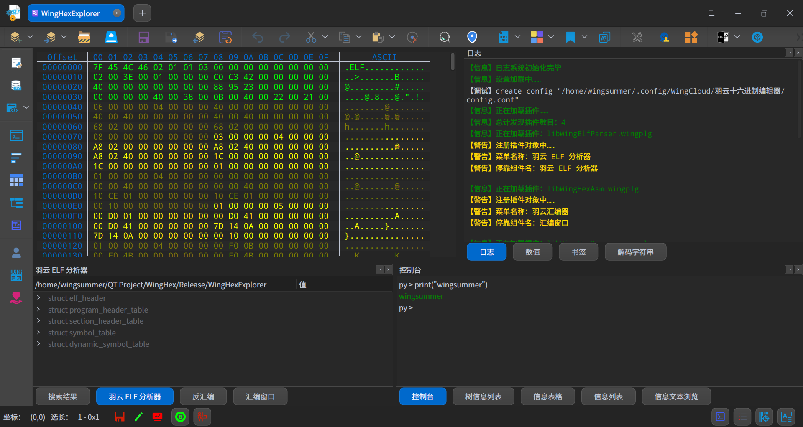

## 关于软件

该软件起源于`WingHexExplorer`，是它的重构翻新版本，修复了大量的 Bug，增强功能。原来的版本是基于`DTK`做的，所以仅仅支持某些`Linux`发行版。原本在`Linux`上没有发现跟`Windows`上媲美好用的开源软件，于是在 2022 年 6 月，我创建了代码仓库开始开发，最后依次更新是在 2023 年 7 月，持续了一年的时间。最后软件长这个样子：

从图上看，这其实是我现在十六进制编辑器的原型。此时软件已经具备插件系统和`Python`脚本的支持，不过仅支持单文件编辑，也没有特别强大，但已经十分够用，并且具有一定的复杂度和专业性。

后来，我不再打算拘泥于`Deepin`这个操作系统，后面它的更新设计让我有点疲惫。在 2024 年 06 月我开启了新的项目`WingHexExplorer2`，对原有的`WingHexExplorer`的重构和功能增强。最初的目的是摆脱`DTK`，在`UI`设计上耗费了我大量的精力，后来逐步定型了，然后我在`Deepin`论坛上发布了初步代码仓库开放的帖子，一直坚持至今。

这个软件从始至终都是我一个人开发的：我自己独立选用现有的开源库，阅读源代码，然后定制、修复原有的 Bug。如果原作者还在维护，我就提一个 PR，看看我的修复能不能合并到里面。自己独立写了上百万行代码，建立起目前具有专业功能的二进制分析和编辑软件。

当然，目前软件仍有一些不足，在`v2.1.0`版本，这个软件会更上一层楼，功能更强大。最重要的是插件系统更强大，也带来了我编写的两个插件。从此以后，我将仅仅简单维护软件，有 Bug 有时间就修，没时间拉倒。有赞助就能够开心几天，心情好了有时间给软件完成一些`TODO`。

## 关于作者

网名/昵称是寂静的羽夏，英文网名有`wingsummer`、`Wing-summer`或`WingSummer`这三种。中国人，羽云系列软件发起人和目前唯一维护者，一个热爱开源的非科班专业贡献者，是一位热爱计算机技术的菜鸟。目前在维护的代表作：[WingHexExplorer2](https://github.com/Wing-summer/WingHexExplorer2)、[WingGifEditor2](https://github.com/Wing-summer/WingGifEditor2) 以及相关插件。

拥有个人博客 [博客园](https://www.cnblogs.com/wingsummer) 。领域主要有软件逆向、`Windows`内核、软件加壳、`C/C++`语言底层实现以及其他略有涉猎的计算机基础知识。

目前作者是一名在读研究生，主要负责对基于光学相干断层成像相关的医疗设备的配套软件进行开发。经常使用的程序栈是`Qt C++`，当然也会`C#`、`Python`，也略懂一点`JavaScript`和前端。

开源不易，如有闲钱可支持我：

> If you are not Chinese, you can use [Afadian](https://afdian.com/a/wingsummer) to support me.

<b>您的每一份支持都将是我开源的强大动力，十分感谢您的支持</b>

感谢支持

