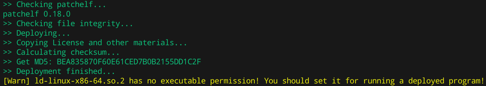

## 文件说明

该目录的工具用于打包 Linux 通用安装包，方便没有编译环境的用户使用该软件，与此同时可以保证较好的通用性。

该工具包打包好的程序已经在 DeepinV23 、KDE Neon 测试过，未发现有啥问题。

如果你要尝试手动打包，首先需要配置好 CMake 的`CMAKE_PREFIX_INSTALL`到你要打包的目录，注意启用`install`，然后编译，完毕后会安装到打包目录中。

然后首先部署（deploy）一下，执行`deploy.py`这个脚本，要把你 **编译目录** 作为参数，注意是你编译的目录，而不是打包目录。该脚本会自行解析并定位到你的打包目录的。如果正常运行的话，你会得到如下输出：

这个警告尤其注意，它在你打包目录的`lib`目录下，你必须将警告中的文件加上可执行权限，否则部署之后的程序因该文件没有可执行权限导致无法执行。 **为啥不放到自动化脚本是因为修改权限需要 root，除非你用桌面的文件属性设置。**

完成部署之后，你就可以打包了，执行`build.sh`这个脚本，要把你 **打包的目录** 作为参数，执行完之后，它会在打包工具目录下创建`build`目录生成一个`WingHexExplorer2-installer.run`文件和一个`payload.tar.gz`文件，前者是安装包，后者是生成安装包中间产物，是对你打包目录进行压缩的一个压缩包。
