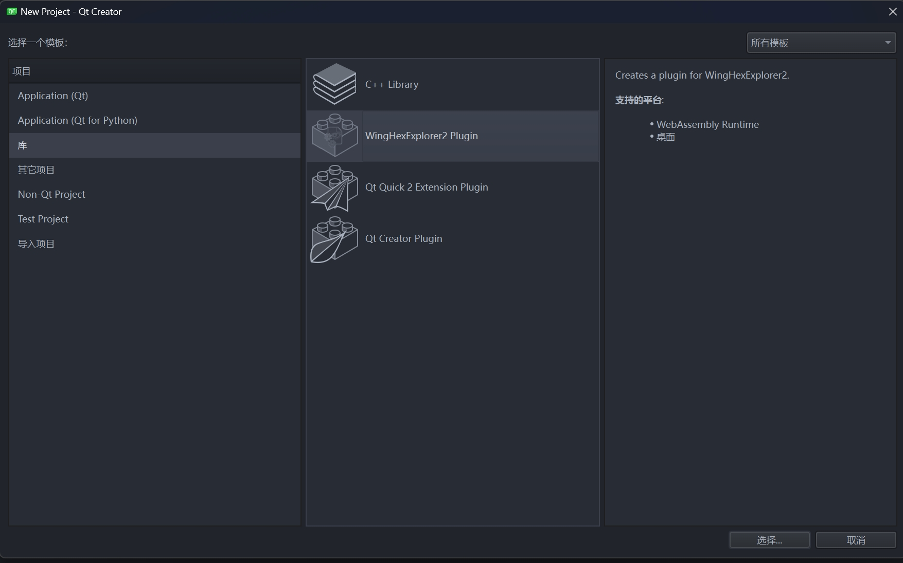
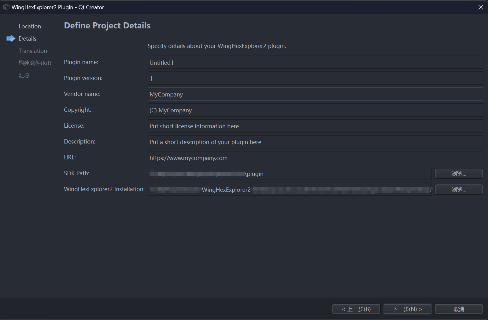
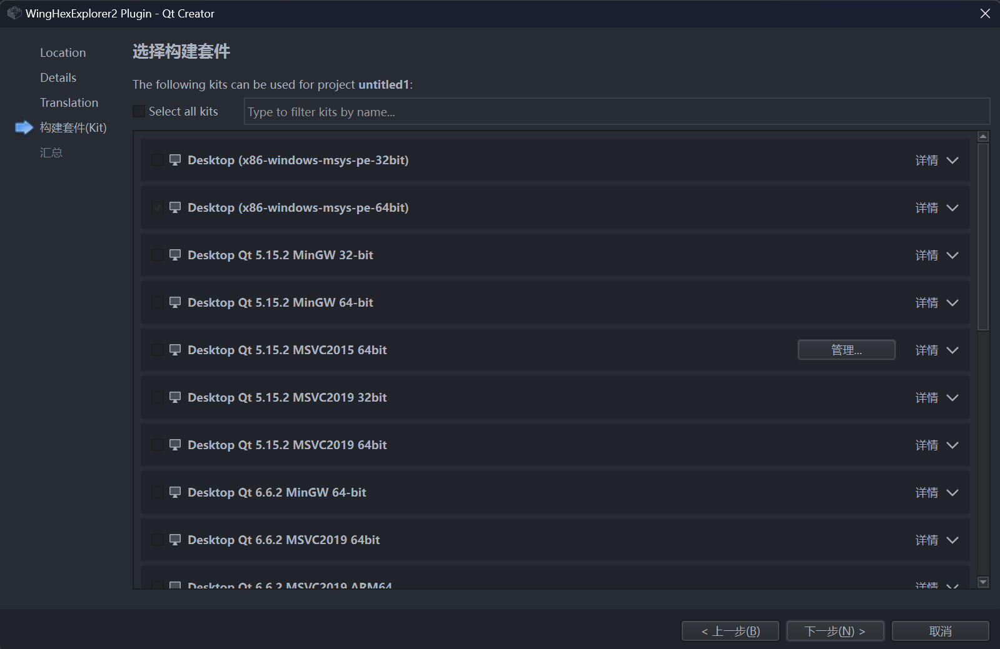
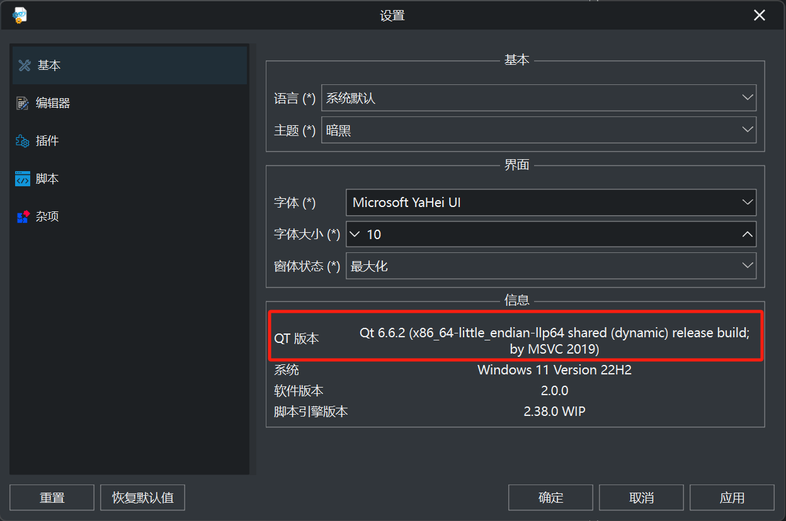

# Qt-Template

&emsp;&emsp;该目录是模板目录，用于存放与插件开发的相关模板，极大的提高开发 WingHexExploer2 的插件便利性。

&emsp;&emsp;目前该目录下只有一个`winghexplugin`，这个存放着 QT 认可的项目模板向导相关文件。而`qt-template-installer.py`是安装管理器，用于方便模板的卸载和安装，你可以使用以下方式进行安装/卸载：

```bash
python3 qt-template-installer.py install  # 安装模板
python3 qt-template-installer.py uninstall # 卸载模板
```

&emsp;&emsp;当然，你可以手动进行安装，只需把`winghexplugin`拷贝到对应的模板存放目录，具体请看 [官方文档](https://docs.huihoo.com/qt/qtcreator/4.2/creator-project-wizards.html#locating-wizards) 。

&emsp;&emsp;安装完毕之后，你在新建项目的 Library 分类下将会看到你已经安装好的模板：



&emsp;&emsp;它和创建`Qt Creator Plugin`的逻辑比较相像，但有不同之处，就是需要指定插件版本和开发库目录以及主程序目录：



&emsp;&emsp;`SDK Paths`填写开发头文件放置的位置，`WingHexExplorer2 Installation`填写安装该十六进制编辑器的安装目录，这里启动程序 **请不要填写安装器给你安装的目录位置，因为启动测试模式会把编译的测试 Dll 拷贝到插件目录，如果没有管理员权限会导致拷贝失败。** 这个软件可以认为是绿色软件的性质，只是建立了文件关联和在个人电脑保存了配置。完全可以把安装目录单独拷贝到一个不需要管理员权限的位置然后继续。



&emsp;&emsp;在选择构建套件时候一定要注意你开发插件的套件的 QT 版本一定要和`WingHexExplorer2`保持一致，不然开发编译之后的插件会因为 Qt 版本检查不通过导致插件无法加载。详细的 QT 版本细节可以到 **软件设置** 的 **基本** 下查看，如下图所示：



&emsp;&emsp;最后祝你开发插件愉快！
